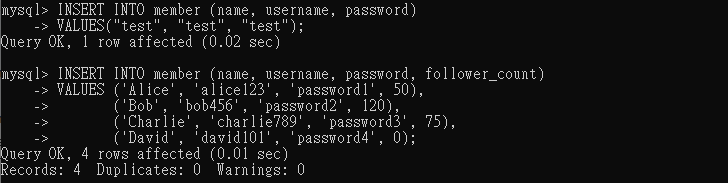

## 1. Run MySQL 
### 1-1. Change Directory 到指定路徑  
	`cd C:\Program Files\MySQL\MySQL Server 8.4\bin`
 
### 1-2. 執行 mysql -u 使用者名稱 -p  
	`mysql -u root -p`

### 1-3. 按下 ENTER 後輸入密碼  


## 2. Task2
### 2-1. 建立資料庫  
`CREATE DATABASE 資料庫名稱` 
### 2-2. 使用要操作的資料庫  
`USE 資料庫名稱` 
### 2-3. 建立資料表  
`CREATE TABLE 資料表名稱(欄位名稱 資料類型 [欄位屬性清單],...)`
```
CREATE DATABASE website;
USE website;
CREATE TABLE member(
	id BIGINT PRIMARY KEY AUTO_INCREMENT,
	name VARCHAR(255) NOT NULL,
	username VARCHAR(255) NOT NULL,
	password VARCHAR(255) NOT NULL,
	follower_count INT UNSIGNED DEFAULT 0,
	time DATETIME NOT NULL DEFAULT CURRENT_TIMESTAMP
);
```


## 3. Task3
### 3-1. 新增紀錄到資料表  
`INSERT [INTO] 資料表 [(欄位名稱, 欄位名稱, 欄位名稱) VALUES(欄位值,欄位值,欄位值)]`
```
INSERT INTO member (name, username, password)
VALUES("test", "test", "test");
```
### 3-2. 新增4筆任意資料
```
INSERT INTO member (name, username, password, follower_count)
VALUES ('Alice', 'alice123', 'password1', 50),
       ('Bob', 'bob456', 'password2', 120),
       ('Charlie', 'charlie789', 'password3', 75),
       ('David', 'david101', 'password4', 0);
```


### 3-3. 查詢資料  
`SELECT [欄位清單|DISTINCT] FROM 資料表`  
`[WHERE 搜尋條件]`  
`[GROUP BY 欄位清單]`  
`[HAVING 搜尋條件]`  
`[ORDER BY 查詢結果排序使用的欄位 [ASC|DESC]]`  

#### WHERE 子句
1. 等於某個值（比較運算子: = != > >= < <=）  
`SELECT * FROM member WHERE username = "test"`
2. 模糊匹配（LIKE）  
`SELECT * FROM member WHERE name LIKE "%es%"`  
	- % 代表任意長度字元（包含零個或多個字元）
	- _ 代表一個任意字元
3. 複合條件（AND, OR）  
`SELECT * FROM member WHERE username = "test" AND password = "test"`
4. 範圍條件（BETWEEN AND）  
`SELECT * FROM Employees WHERE Age BETWEEN 30 AND 40`
5. 匹配某些值（IN）  
`SELECT * FROM Employees WHERE Department IN ('HR', 'Sales')`
6. 空值檢查（IS NULL 和 IS NOT NULL）  
`SELECT * FROM Employees WHERE Email IS NULL;`
7. 否定條件（NOT）  
`SELECT * FROM Employees WHERE NOT Age = 30;`

#### ORDER BY 子句
1. 欄位降序排序（DESC），默認是升序（ASC）。  
`SELECT Name, Age FROM Employees ORDER BY Age DESC`
2. 限制排序後的結果數量（LIMIT）  
`SELECT * FROM member ORDER BY time DESC LIMIT 3 OFFSET 1`  
	- LIMIT：限制返回的行數。
	- OFFSET：跳過指定數量的行。
```
SELECT * FROM member;
SELECT * FROM member ORDER BY time DESC;
SELECT * FROM member ORDER BY time DESC LIMIT 3 OFFSET 1;
SELECT * FROM member WHERE username = "test";
SELECT * FROM member WHERE name LIKE "%es%";
SELECT * FROM member WHERE username = "test" AND password = "test";
```


### 3-4. 更新資料  
`UPDATE 資料表名稱 SET 欄位名稱 = 新的欄位值`  
`[WHERE 更新條件]`  
#### 安全更新模式 SQL_SAFE_UPDATES 
- 預設是1，保護資料庫，限制安全的更新操作。在WHERE條件中，沒有KEY（primary key）時會發生錯誤。
- 關閉安全模式。 `SQL_SAFE_UPDATES=0`  
- 更新完成後回復安全模式。 `SQL_SAFE_UPDATES=1`  

```
SET SQL_SAFE_UPDATES=0;
UPDATE member SET name = "test2" WHERE username = "test";
SET SQL_SAFE_UPDATES=1;
```


## 4. Task4
### 使用聚合函數計算
1. 計數 COUNT( )  
2. 求和 SUM( )  
3. 平均值 AVG( )
4. 最大值 MAX( )
5. 最小值 MIN( )
```
SELECT COUNT(*) FROM member;
SELECT SUM(follower_count) FROM member;
SELECT AVG(follower_count) FROM member;
SELECT AVG(follower_count) FROM member
ORDER BY follower_count DESC 
LIMIT 2;
```


## 5. Task5 
### 5-1. 使用要操作的資料庫  
`USE 資料庫名稱` 
### 5-2. 建立資料表  
```
CREATE TABLE 資料表名稱1(
	欄位名稱 資料類型 [欄位屬性清單],
	...,
	FOREIGN KEY (欄位名稱) REFERENCES 資料表名稱2(欄位名稱)
)
```
#### 鍵 KEY
1. PRIMARY KEY （PK）  
	- 唯一（UNIQUE）
	- 非空（NOT NULL）  
	- 複合鍵（Compound Key）應用在主鍵  
	```
	CREATE TABLE order_items (
    order_id INT,
    product_id INT,
    quantity INT,
    PRIMARY KEY (order_id, product_id)
	);
	```
2. FOREIGN KEY（FK）  
	- 参照完整性: 外鍵的值來自引用鍵的值，兩者必須有相似的資料型別。
	- 外鍵約束: 外鍵可以確保資料的一致性和完整性。
```
USE website;
CREATE TABLE message(
	id BIGINT PRIMARY KEY AUTO_INCREMENT,
	member_id BIGINT NOT NULL,
	content VARCHAR(255) NOT NULL,
	like_count VARCHAR(255) NOT NULL DEFAULT 0,
	time DATETIME NOT NULL DEFAULT CURRENT_TIMESTAMP,
    FOREIGN KEY (member_id) REFERENCES member(id)
);
```


### 5-3. 新增4筆任意資料
```
INSERT INTO message (member_id, content, like_count)
VALUES ('2', 'message1', 50),
       ('3', 'message2', 120),
       ('2', 'message3', 75),
       ('1', 'message4', 0);
```


### 5-4. 合併查詢資料
`SELECT 欄位清單 FROM 資料表1`   
`JOIN 資料表2 ON 合併條件`
#### AS 取一個別名
1. 給欄位取別名  
`SELECT FirstName AS 'First Name', LastName AS 'Last Name' FROM Employees`
2. 給資料表取別名  
`SELECT o.OrderID, c.CustomerName FROM Orders AS o JOIN Customers AS c ON o.CustomerID = c.CustomerID`
3. 可以直接使用空格來指定別名
`SELECT FirstName 'First Name', LastName 'Last Name' FROM Employees;`
#### GROUP BY 子句
`[GROUP BY 欄位清單]`   
1. GROUP BY 子句用於將資料分組，必須與聚合函數一起使用，否則 SQL 查詢會報錯，因為 SQL 不知道如何處理不在 GROUP BY 中指定的欄位。
2. GROUP BY 必須出現在 WHERE 子句之後，HAVING 子句之前。
```
SELECT m.id AS message_id, m.content, m.like_count, m.time, mem.name AS sender_name
FROM message m
JOIN member mem ON m.member_id = mem.id;

SELECT m.id AS message_id, m.content, m.like_count, m.time, mem.name AS sender_name
FROM message m
JOIN member mem ON m.member_id = mem.id
WHERE mem.username = "test";

SELECT AVG(m.like_count) AS avg_like_count
FROM message m
JOIN member mem ON m.member_id = mem.id
WHERE mem.username = "test";

SELECT mem.username, AVG(m.like_count) AS avg_like_count
FROM message m
JOIN member mem ON m.member_id = mem.id
GROUP BY mem.username;
```


## 6. Exit MySQL
`exit`  
`quit`  
`bye`  
`Ctrl`+`Z`  


## 7. Backup Database 
### 執行 mysqldump -u 使用者名稱 -p  資料庫名稱 > 備份路徑\檔案名稱.sql
`mysqldump -u root -p website > C:\1_JsData\wehelp\wehelp-step1\week5\data.sql`


